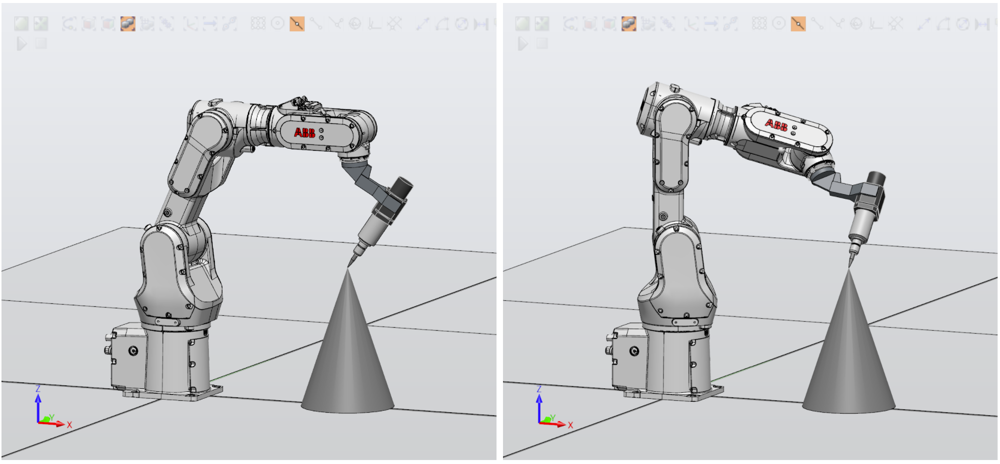

# Robot-Tool_Calibration


Find Transformation from Tool Flange to Tool Tip (TCP)




```matlab
[p_tip,pivit_loc] = ToolCalib(R_track, p_track)
```


**Input:**

- R_track is 3\*3\*n Rotation Matrix
- p_track is 3*n Translation Vector


For formular, detail and demo, check: <u>demo_Pivot_Calibration.mlx</u>
